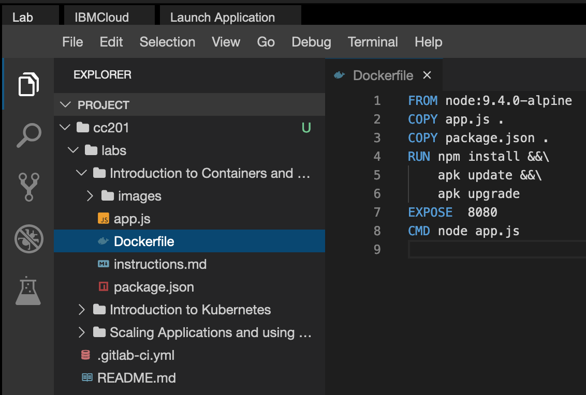
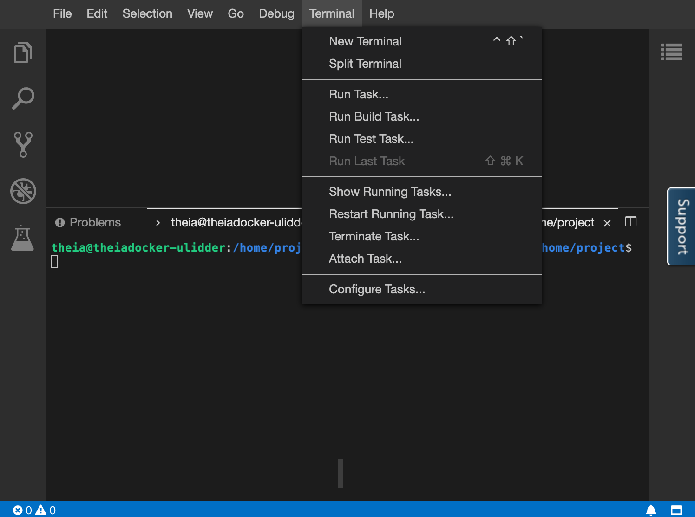

<center>

</center>

# Introduction to Containers, Docker, and IBM Cloud Container Registry

## Objectives
In this lab, you will:
- Pull an image from Docker Hub
- Run an image as a container using `docker`
- Build an image using a Dockerfile
- Push an image to IBM Cloud Container Registry

**Important:**
You may already have an IBM Cloud account and may even have a namespace in the IBM Container Registry (ICR). However, in this lab **you will not be using your own IBM Cloud account or your own ICR namespace**. You will be using an IBM Cloud account that has been automatically generated for you for this excercise. The lab environment will _not_ have access to any resources within your personal IBM Cloud account, including ICR namespaces and images.

# Verify the environment and command line tools
1. Open a terminal window by using the menu in the editor: `Terminal > New Terminal`.


2. Verify that `docker` CLI is installed.
```
docker --version
```
{: codeblock}

You should see output similar to this, though the version may be different:
```
Docker version 18.09.7, build 2d0083d
```

3. Verify that `ibmcloud` CLI is installed.
```
ibmcloud version
```
{: codeblock}

You should see output similar to this, though the version may be different:
```
ibmcloud version 1.0.0+908f90a-2020-03-30T06:37:22+00:00
```

3. Change to your project folder.
```
cd /home/project
```
{: codeblock}

4. Clone the git repository that contains the artifacts needed for this lab.
```
git clone https://gitlab.com/ibm/skills-network/courses/cc201.git
```
{: codeblock}

5. Change to the directory for this lab.
```
cd cc201/labs/1_ContainersAndDocker/
```
{: codeblock}

6. List the contents of this directory to see the artifacts for this lab.
```
ls
```
{: codeblock}

# Pull an image from Docker Hub and run it as a container
1. Use the `docker` CLI to list your images.
```
docker images
```
{: codeblock}

You should see an empty table since you don't have any images yet.

2. Pull your first image from Docker Hub.
```
docker pull hello-world
```
{: codeblock}

3. List images again to see this image in the local environment.
```
docker images
```
{: codeblock}

You should now see the `hello-world` image present in the table.

4. Run the `hello-world` image as a container.
```
docker run hello-world
```
{: codeblock}

This command prints out a simple hello message and some explanation of what Docker did to generate this message.

5. List the containers to see that your container ran and exited successfully.
```
docker ps -a
```
{: codeblock}

Among other things, for this container you should see a container ID, the image name (`hello-world`), and a status that indicates that the container exited successfully.

6. Note the container ID from the previous step, and remove the container now that we've run it.
```
docker container rm <container_id>
```
{: codeblock}

Congratulations on pulling an image and running your first container! Now let's build an image on our own instead of using one pulled from Docker Hub.

# Build an image using a Dockerfile
1. The current working directory contains a simple Node.js application that we will run in a container. The app will print a hello message along with the hostname. The following files are needed to run the app in a container:
- app.js is the main application, which simply replies with a hello world message.
- package.json defines the dependencies of the application.
- Dockerfile defines the instructions Docker uses to build the image.

2. Use the Explorer to view the files needed for this app. Click the Explorer icon (it looks like a sheet of paper) on the left side of the window, and then navigate to the directory for this lab: `cc201 > labs > 1_ContainersAndDocker`. Click `Dockerfile` to view the Dockerfile we'll use to build an image. If you don't understand any of the instructions in the Dockerfile, review the module videos.


3. Run the following command to build the image:
```
docker build . -t myimage:v1
```
{: codeblock}

As seen in the module videos, the output should include a step for each instruction in the Dockerfile. Each step creates a new layer in the image.

4. List images to see your image tagged `myimage:v1` in the table.
```
docker images
```
{: codeblock}

Note that compared to the `hello-world` image, this image has a different image ID. This means that the two images consist of different layers -- in other words, they're not the same image.

You should also see a `node` image in the images output. This is because the `docker build` command pulled `node:9.4.0-alpine` to use it as the base image for the image you built.

# Run the image as a container
1. Now that your image is built, run it as a container with the following command:
```
docker run -p 8080:8080 myimage:v1
```
{: codeblock}

The output should indicate that your application is listening on port 8080. This command will continue running until it is quit, since the container runs a web app that continually listens for requests. To query the app, we need to open another terminal window.

2. To split the terminal, click `Terminal > Split Terminal`.


3. In the second terminal window, use the `curl` command to ping the application.
```
curl localhost:8080
```
{: codeblock}

The output should indicate that your app is up and running.

4. In the second terminal window, stop the container. The following command uses `docker ps -q` to pass in the list of all running containers:
```
docker stop $(docker ps -q)
```
{: codeblock}

5. Close the second terminal window, as it is no longer needed.
```
exit
```
{: codeblock}

In the original terminal window, the `docker run` command has exited and you are able to type commands in that terminal window again.

# Push the image to IBM Cloud Container Registry
1. The environment should have already logged you into the IBM Cloud account that has been automatically generated for you by the Skills Network Labs environment. The following command will give you information about the account you're targeting:
```
ibmcloud target
```
{: codeblock}

2. The environment also created an IBM Cloud Container Registry (ICR) namespace for you. Since Container Registry is multi-tenant, namespaces are used to divvy up the registry among several users. Use the following command to see the namespaces you have access to:
```
ibmcloud cr namespaces
```
{: codeblock}

You should see two namespaces listed starting with `sn-labs`:

- The first one with your username is a namespace just for you. You have full _read_ and _write_ access to this namespace.
- The second one is a shared namespace you only have _read_ access to.

3. Ensure that you are targeting the `us-south` region where these namespaces reside as you saw in the output of the `ibmcloud target` command.
```
ibmcloud cr region-set us-south
```
{: codeblock}

4. Log your local Docker daemon into IBM Cloud Container Registry so that you can push to and pull from the registry.
```
ibmcloud cr login
```
{: codeblock}

5. Export your namespace as an environment variable so that it can be used in subsequent commands.
```
export MY_NAMESPACE=$(ibmcloud cr namespaces|grep sn-labs-|xargs)
```
{: codeblock}

6. Tag your image so that it can be pushed to IBM Cloud Container Registry.
```
docker tag myimage:v1 us.icr.io/$MY_NAMESPACE/hello-world:1
```
{: codeblock}

7. Push the newly tagged image to IBM Cloud Container Registry.
```
docker push us.icr.io/$MY_NAMESPACE/hello-world:1
```
{: codeblock}

8. Verify that the image was successfully pushed by listing images in Container Registry.
```
ibmcloud cr images
```
{: codeblock}

Optionally, to only view images within a specific namespace.
```
ibmcloud cr images --restrict $MY_NAMESPACE
```
{: codeblock}

You should see your image name in the output. Recall from the module videos that we discussed Vulnerability Advisor, which scans images in IBM Cloud Container Registry for common vulnerabilities and exposures. In the last column of the output, note that Vulnerability Advisor is either scanning your image or it has provided a security status, depending on how quickly you list the images and how long the scan takes.

Congratulations! You have completed the second lab for the first module of this course.
