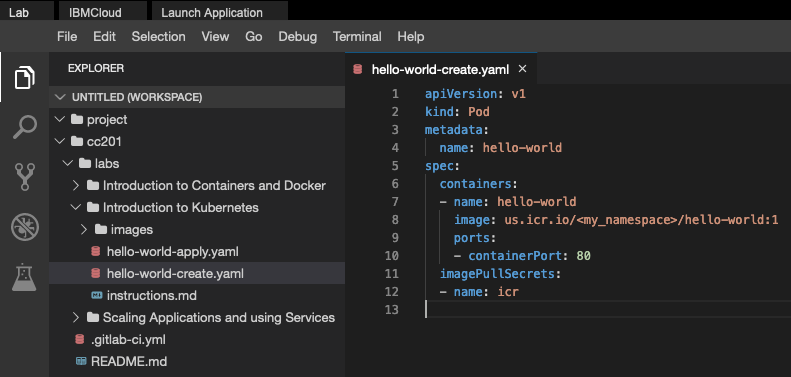

<center>

</center>

# Introduction to Kubernetes

## Objectives
In this lab, you will:
- Use the `kubectl` CLI
- Create a Kubernetes Pod
- Create a Kubernetes Deployment
- Create a ReplicaSet that maintains a set number of replicas
- Witness Kubernetes load balancing in action

# Verify the environment and command line tools
1. If a terminal is not already open, open a terminal window by using the menu in the editor: `Terminal > New Terminal`.


2. Verify that `kubectl` CLI is installed.
```
kubectl version
```
{: codeblock}

You should see output similar to this, though the versions may be different:
```
Client Version: version.Info{Major:"1", Minor:"17", GitVersion:"v1.17.2", GitCommit:"59603c6e503c87169aea6106f57b9f242f64df89", G
itTreeState:"clean", BuildDate:"2020-01-18T23:30:10Z", GoVersion:"go1.13.5", Compiler:"gc", Platform:"linux/amd64"}
Server Version: version.Info{Major:"1", Minor:"16", GitVersion:"v1.16.10+IKS", GitCommit:"a0052bd119c067cf48e8a19f0ab7d5a5e2ca0a1
8", GitTreeState:"clean", BuildDate:"2020-05-20T20:48:06Z", GoVersion:"go1.13.9", Compiler:"gc", Platform:"linux/amd64"}
```

3. Change to your project folder.
```
cd /home/project
```
{: codeblock}

4. Clone the git repository that contains the artifacts needed for this lab, if it doesn't already exist.
```
[ ! -d 'cc201' ] && git clone https://gitlab.com/ibm/skills-network/courses/cc201.git
```
{: codeblock}

5. Change to the directory for this lab.
```
cd cc201/labs/2_IntroKubernetes/
```
{: codeblock}

6. List the contents of this directory to see the artifacts for this lab.
```
ls
```
{: codeblock}

# Use the `kubectl` CLI
Recall that Kubernetes namespaces enable you to virtualize a cluster. You already have access to one namespace in a Kubernetes cluster, and `kubectl` is already set to target that cluster and namespace.

Let's look at some basic `kubectl` commands.

1. `kubectl` requires configuration so that it targets the appropriate cluster. Get cluster information with the following command:
```
kubectl config get-clusters
```
{: codeblock}

2. A `kubectl` context is a group of access parameters, including a cluster, a user, and a namespace. View your current context with the following command:
```
kubectl config get-contexts
```
{: codeblock}

3. List all the Pods in your namespace. If this is a new session for you, you will not see any Pods.
```
kubectl get pods
```
{: codeblock}

# Create a Pod with an imperative command
Now it's time to create your first Pod. This Pod will run the `hello-world` image you built and pushed to IBM Cloud Container Registry in the last lab. As explained in the videos for this module, you can create a Pod imperatively or declaratively. Let's do it imperatively first.

1. Export your namespace as an environment variable so that it can be used in subsequent commands.
```
export MY_NAMESPACE=sn-labs-$USERNAME
```
{: codeblock}

2. Build and push the image again, as it may have been deleted automatically since you completed the first lab.
```
docker build -t us.icr.io/$MY_NAMESPACE/hello-world:1 . && docker push us.icr.io/$MY_NAMESPACE/hello-world:1
```
{: codeblock}

3. Run the `hello-world` image as a container in Kubernetes.
```
kubectl run hello-world --image us.icr.io/$MY_NAMESPACE/hello-world:1 --overrides='{"spec":{"template":{"spec":{"imagePullSecrets":[{"name":"icr"}]}}}}'
```
{: codeblock}

The `--overrides` option here enables us to specify the needed credentials to pull this image from IBM Cloud Container Registry. Note that this is an imperative command, as we told Kubernetes explicitly what to do: run `hello-world`.

4. List the Pods in your namespace.
```
kubectl get pods
```
{: codeblock}

Great, the previous command indeed created a Pod for us. You can see an auto-generated name was given to this Pod.

You can also specify the wide option for the output to get more details about the resource.
```
kubectl get pods -o wide
```
{: codeblock}

5. Describe the Pod to get more details about it.
```
kubectl describe pod hello-world
```
{: codeblock}

6. Delete the Pod.
```
kubectl delete pod hello-world
```
{: codeblock}

7. List the Pods to verify that none exist.
```
kubectl get pods
```
{: codeblock}

# Create a Pod with imperative object configuration
Imperative object configuration lets you create objects by specifying the action to take (e.g., create, update, delete) while using a configuration file. A configuration file, `hello-world-create.yaml`, is provided to you in this directory.

1. Use the Explorer to view and edit the configuration file. Click the Explorer icon (it looks like a sheet of paper) on the left side of the window, and then navigate to the directory for this lab: `cc201 > labs > 2_IntroKubernetes`. Click `hello-world-create.yaml` to view the configuration file.


2. Use the Explorer to edit `hello-world-create.yaml`. You need to insert your namespace where it says `<my_namespace>`. Make sure to save the file when you're done.

3. Imperatively create a Pod using the provided configuration file.
```
kubectl create -f hello-world-create.yaml
```
{: codeblock}

Note that this is indeed imperative, as you explicitly told Kubernetes to *create* the resources defined in the file.

4. List the Pods in your namespace.
```
kubectl get pods
```
{: codeblock}

5. Delete the Pod.
```
kubectl delete pod hello-world
```
{: codeblock}

This command can take some time to run.

# Create a Pod with a declarative command
The previous two ways to create a Pod were imperative -- we explicitly told `kubectl` what to do. While the imperative commands are easy to understand and run, they are not ideal for a production environment. Let's look at declarative commands.

1. A sample `hello-world-apply.yaml` file is provided in this directory. Use the Explorer again to open this file. Notice the following:
- We are creating a Deployment (`kind: Deployment`).
- There will be three replica Pods for this Deployment (`replicas: 3`).
- The Pods should run the `hello-world` image (`- image: us.icr.io/<my_namespace>/hello-world:1`).
You can ignore the rest for now. We will get to a lot of those concepts in the next lab.

2. Use the Explorer to edit `hello-world-apply.yaml`. You need to insert your namespace where it says `<my_namespace>`. Make sure to save the file when you're done.

3. Use the `kubectl apply` command to set this configuration as the desired state in Kubernetes.
```
kubectl apply -f hello-world-apply.yaml
```
{: codeblock}

4. Get the Deployments to ensure that a Deployment was created.
```
kubectl get deployments
```
{: codeblock}

5. List the Pods to ensure that three replicas exist.
```
kubectl get pods
```
{: codeblock}

With declarative management, we did not tell Kubernetes which actions to perform. Instead, `kubectl` inferred that this Deployment needed to be created. If you delete a Pod now, a new one will be created in its place to maintain three replicas.

6. Note one of the Pod names from the previous step, and delete that Pod.
```
kubectl delete pod <pod_name>
```
{: codeblock}

This command can take some time to run.

7. List the Pods to see a new one being created.
```
kubectl get pods
```
{: codeblock}

If you do this quickly enough, you can see one Pod being terminated and another Pod being created.
```
NAME                    READY   STATUS              RESTARTS   AGE
hello-world-dd6b5d745-2jw5s   0/1     Terminating         0          35s
hello-world-dd6b5d745-f9xjk   1/1     Running             0          35s
hello-world-dd6b5d745-m89fc   0/1     ContainerCreating   0          8s
hello-world-dd6b5d745-qvs9t   1/1     Running             0          35s
```
Otherwise, the status of each will be the same, but the age of one Pod will be less than the others.
```
NAME                    READY   STATUS    RESTARTS   AGE
hello-world-dd6b5d745-f9xjk   1/1     Running   0          39s
hello-world-dd6b5d745-m89fc   1/1     Running   0          12s
hello-world-dd6b5d745-qvs9t   1/1     Running   0          39s
```

# Load balancing the application
Since there are three replicas of this application deployed in the cluster, Kubernetes will load balance requests across these three instances. Let's expose our application to the internet and see how Kubernetes load balances requests.

1. In order to access the application, we have to expose it to the internet using a Kubernetes Service.
```
kubectl expose deployment/hello-world --type=NodePort --port=8080 --name=hello-world --target-port=8080
```
{: codeblock}

This command creates what is called a NodePort Service. This will open up a port on the worker node to allow the application to be accessed using that port and the IP address of the node.

2. List Services in order to see that this service was created.
```
kubectl get services
```
{: codeblock}

3. Two things are needed to access this application: a worker node IP address and the correct port. To get a worker node IP, rerun the `get pods` command with the `wide` option and note any one of the node IP addresses (from the column entitled `NODE`):
```
kubectl get pods -o wide
```
{: codeblock}

Here is some sample output.
```
NAME                          READY   STATUS    RESTARTS   AGE   IP               NODE            NOMINATED NODE   READINESS GATES
hello-world-dd6b5d745-f9xjk   1/1     Running   0          7m    172.30.104.185   10.114.85.153   <none>           <none>
hello-world-dd6b5d745-m89fc   1/1     Running   0          7m    172.30.165.182   10.114.85.151   <none>           <none>
hello-world-dd6b5d745-qvs9t   1/1     Running   0          7m    172.30.69.68     10.114.85.172   <none>           <none>
```
Using this sample output, you could choose `10.114.85.153`, `10.114.85.151`, or `10.114.85.172` for the node IP address.

4. Export the node IP address as an environment variable. Make sure to substitute the copied IP address into this command.
```
export NODE_IP=<node_ip>
```
{: codeblock}

Using the sample output, one correct command would be `export NODE_IP=10.114.85.153`.

5. To get the port number, run the following command and note the port:
```
kubectl get services
```
{: codeblock}

Here is some sample output. In this sample, the port number we need is `31758`.
```
NAME          TYPE       CLUSTER-IP      EXTERNAL-IP   PORT(S)          AGE
hello-world   NodePort   172.21.121.84   <none>        8080:31758/TCP   58s
```

6. Export the port as an environment variable. Make sure to substitute the copied port into this command.
```
export NODE_PORT=<node_port>
```
{: codeblock}

Using the sample output, the correct command would be `export NODE_PORT=31758`.

7. Ping the application to get a response.
```
curl $NODE_IP:$NODE_PORT
```
{: codeblock}

8. Notice that this output includes the Pod name. Run the command ten times and note the different Pod names in each line of output.
```
for i in `seq 10`; do curl $NODE_IP:$NODE_PORT; done
```
{: codeblock}

You should see more than one Pod name, and quite possibly all three Pod names, in the output. This is because Kubernetes load balances the requests across the three replicas, so each request could hit a different instance of our application.

9. Delete the Deployment and Service. This can be done in a single command by using slashes.
```
kubectl delete deployment/hello-world service/hello-world
```
{: codeblock}

Congratulations! You have completed the lab for the second module of this course.
