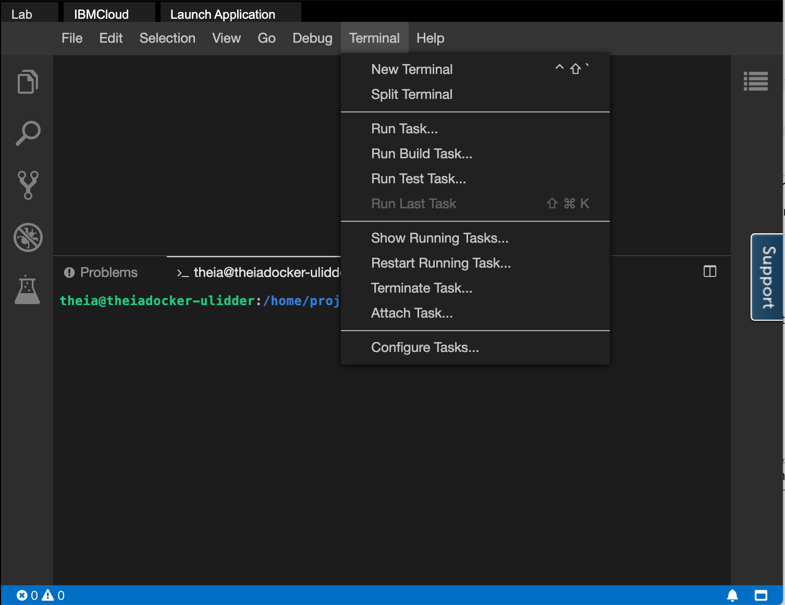
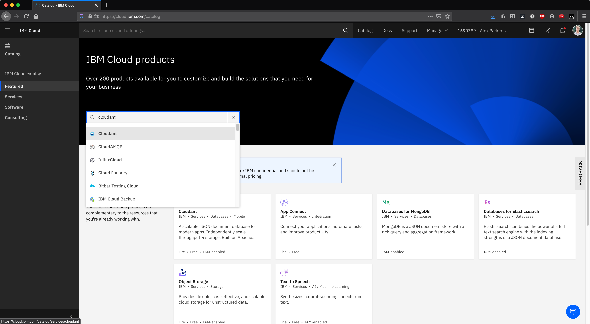

<center>

</center>

# Final Project

## Objectives
In this lab, you will:
- Build and deploy a simple health application
- Use OpenShift image streams to roll out an update
- Redeploy the health app using an OpenShift build
- Create a Cloudant service instance on IBM Cloud
- Bind the Cloudant service instance to your application
- Autoscale the health app

# Project Overview

## Health application
The health application is a simple, multi-tier web application that we will build and deploy with Docker and Kubernetes. The application consists of a web front end and an adapter that serves data from a Cloudant database to the front end application. For both of these we will create Kubernetes Deployments, Pods, and Services.

We will deploy and manage this entire application on OpenShift.

# Verify the environment and command line tools
1. If a terminal is not already open, open a terminal window by using the menu in the editor: `Terminal > New Terminal`.


2. Change to your project folder.
```
cd /home/project
```
{: codeblock}

3. Clone the git repository that contains the artifacts needed for this lab.
```
git clone https://github.com/ajp-io/patient-ui.git
```
{: codeblock}

4. Change to the directory for this lab.
```
cd patient-ui
```
{: codeblock}

5. List the contents of this directory to see the artifacts for this lab.
```
ls
```
{: codeblock}

# Build the health app
To begin, we will build and deploy the web front end for the health app.

1. Run the following command or open the Dockerfile in the Explorer to familiarize yourself with it. The path to this file is `patient-ui/Dockerfile`.
```
cat Dockerfile
```
{: codeblock}

2. Export your namespace as an environment variable so that it can be used in subsequent commands.
```
export MY_NAMESPACE=$(ibmcloud cr namespaces|grep sn-labs-|xargs)

```
{: codeblock}

3. Build the health app.
```
docker build . -t us.icr.io/$MY_NAMESPACE/patient-ui:v1
```
{: codeblock}

4. Push the image to IBM Cloud Container Registry.
```
docker push us.icr.io/$MY_NAMESPACE/patient-ui:v1
```
{: codeblock}

5. Verify that the image was pushed successfully.
```
ibmcloud cr images
```
{: codeblock}

# Deploy health app from the OpenShift internal registry
As discussed in the course, IBM Cloud Container Registry scans images for common vulnerabilities and exposures to ensure that images are secure. But OpenShift also provides an internal registry -- recall the discussion of image streams and image stream tags. Using the internal registry has benefits too. For example, there is less latency when pulling images for deployments. What if we could use both—use IBM Cloud Container Registry to scan our images and then automatically import those images to the internal registry for lower latency?

1. Create an image stream that points to your image in IBM Cloud Container Registry.
```
oc tag us.icr.io/$MY_NAMESPACE/patient-ui:v1 patient-ui:v1 --reference-policy=local --scheduled
```
{: codeblock}

With the `--reference-policy=local` option, a copy of the image from IBM Cloud Container Registry is imported into the local cache of the internal registry and made available to the cluster's projects as an image stream. The `--schedule` option sets up periodic importing of the image from IBM Cloud Container Registry into the internal registry. The default frequency is 15 minutes.

Now let's head over to the OpenShift web console to deploy the health app using this image stream.

2. Open the OpenShift web console using the link at the top of the lab environment.

3. From the Developer perspective, click the **+Add** button to add a new application to this project.

4. Click the **Container Image** option so that we can deploy the application using an image in the internal registry.

5. Under **Image**, switch to "Image name from internal registry".

6. Select your project, and the image stream and tag you just created (`patient-ui` and `v1`, respectively). You should have only have one option for each of these fields anyway since you only have access to a single project and you only created one image stream and one image stream tag.

7. Keep all the default values and hit **Create** at the bottom. This will create the application and take you to the Topology view.

8. From the Topology view, click the `patient-ui` Deployment. This should take you to the **Resources** tab for this Deployment, where you can see the Pod that is running the application as well as the Service and Route that expose it.

9. Click the Route location (the link) to view the health app in action.

10. Log into the health app using any credentials. Since the app is in demo mode right now, it will accept any credentials you enter.

# Update the health app
Let's update the health app and see how OpenShift's image streams can help us update our apps with ease.

1. Use the Explorer to edit `login.html` in the `public` directory. The path to this file is `patient-ui/public/login.html`.

2. Let's edit the name beneath the logo to be more specific. On the line that says `<div class="Fictionalname">Example Health</div>`, change it to include your name. Something like `<div class="Fictionalname">Alex's Example Health</div>`. Make sure to save the file when you're done.

3. Build and push the app again using the same tag. This will overwrite the previous image.
```
docker build . -t us.icr.io/$MY_NAMESPACE/patient-ui:v1 && docker push us.icr.io/$MY_NAMESPACE/patient-ui:v1
```
{: codeblock}

4. Recall the `--schedule` option we specified when we imported our image into the OpenShift internal registry. As a result, OpenShift will regularly import new images pushed to the specified tag. Since we pushed our newly built image to the same tag, OpenShift will import the updated image within about 15 minutes. If you don't want to wait for OpenShift to automatically import the updated image, run the following command.
```
oc import-image patient-ui:v1 --from=us.icr.io/$MY_NAMESPACE/patient-ui:v1 --confirm
```
{: codeblock}

5. Switch to the Administrator perspective so that you can view image streams.

6. Click **Builds** > **Image Streams** in the navigation.

7. Click the `patient-ui` image stream.

8. Click the **History** menu. If you only see one entry listed here, it means OpenShift hasn't imported your new image yet. Wait a few minutes and refresh the page. Eventually you should see a second entry, indicating that a new version of this image stream tag has been imported. This can take some time as the default frequency for importing is 15 minutes.

9. Return to the Developer perspective.

10. View the health app in the browser again. If you still have the tab open, go there. If not, click the Route again from the `patient-ui` Deployment. You should see your new title on this page! OpenShift imported the new version of our image, and since the Deployment points to the image stream, it began running this new version as well.

# Health app storage
1. From the health app in the browser, click the **Settings** link. If you're on the login page, this is beneath the login box. If you have already logged in, this is in the top navigation. This shows the current settings for the health app. Currently, the app is running in demo mode, which means that it serves static information on one mock patient. We want the app to require valid login credentials and to store patient details in a database instead of in memory.

# Create a Cloudant service instance
We've demonstrated that we need persistent storage in order for the health app to be effective. Let's deploy Cloudant so that we get just that. IBM Cloudant is a fully managed, distributed database that is optimized for handling heavy workloads that are typical of large, fast-growing web and mobile apps. Cloudant is built on open source Apache CouchDB.

1. Go to the [IBM Cloud catalog](https://cloud.ibm.com/catalog).

2. Sign in with your personal account. You should have created one during a lab in the first module of this course.

3. In the search box, type "cloudant". A dropdown should show appear and show services. Click the "Cloudant" service as seen in the image below.


4. You'll create an instance on the Lite plan, which is free. Scroll down to **Authentication method** and change it to **IAM and legacy credentials**. If you do not change the **Authentication Method** to **IAM and legacy credentials**, the lab will not work as expected. Take note of the resource group, as you'll need this later. It may be something like "Default".

5. Leave all the other default options and click **Create**. This will take you to the IBM Cloud resource list page.

6. It will take a few minutes to provision the Cloudant service instance. Find your Cloudant instance under the **Services** section. Refresh the page a few times. Once the status on your instance is **Active**, click the instance to go to its details page.

7. Now that you have an instance, you need credentials with which you can access it. Click **Service credentials** on the left navigation, and click **New credential**.

8. Name the new credential "cloudant-health-creds". Leave the role as **Manager** and click **Add**.

9. We need to store this credential in a Kubernetes secret in order for our patient database microservice to utilize it. From the terminal in the lab environment, login to your IBM Cloud account with your username and password.
```
ibmcloud login -u <your_email_address>
```
{: codeblock}

10. Ensure that you target the resource group in which you created the Cloudant service. Remember that you noted this resource group in a previous step.
```
ibmcloud target -g <resource_group>
```
{: codeblock}

11. Use the Explorer to edit `binding-hack.sh`. The path to this file is `patient-ui/binding-hack.sh`. You need to insert your OpenShift project where it says `<my_project>`. Your project is `sn-labs-` followed by your username. If you don't remember your project name, run `oc project`. Make sure to save the file when you're done.

12. Run the script to create a Secret containing credentials for your Cloudant service.
```
./binding-hack.sh
```
{: codeblock}

You should see the following output: `secret/cloudant-binding created`.

13. Log back into the lab account. You have to use your lab account to use the Open Shift console; it will not work with your IBM Cloud credentials.
```
ibmcloud login --apikey $IBMCLOUD_API_KEY
```
{: codeblock}

# Deploy the patient database microservice
Now that the Cloudant service instance is created and its credentials are provided in a Kubernetes Secret, we can deploy the patient database microservice. This microservice populates your Cloudant instance with patient data on startup, and it also serves that data to the front end application that you have already deployed.

1. Create the patient database application. This will start a source-to-image build.
```
oc new-app --name=patient-db centos/nodejs-10-centos7~https://github.com/ajp-io/patient-db-adapter
```
{: codeblock}

2. From the Topology view, wait for the build to complete, and then click the new `patient-db` DeploymentConfig that was created.

3. Note that the Pod for this DeploymentConfig is in an error state. Click **View logs**.

4. Note that the app is failing because of this error: "Cannot find Cloudant credentials, set CLOUDANT_URL." We need to set the Cloudant URL so that the app can communicate with your instance of Cloudant.

5. From the Topology view, click the `patient-db` DeploymentConfig, and then click the `patient-db` name at the top to see details on this DeploymentConfig.

6. Click the **Environment** tab.

7. Click **Add from Config Map or Secret**.

8. Enter "CLOUDANT_URL" for **name**. For **Select a resource**, choose `cloudant-binding`, and for **Select a key**, choose "url".

9. Click **Save** at the bottom.

10. Click the **Pods** tab and look at the newly created Pod. Its status should be **Running** now since it has the Cloudant URL and is able to start. Click the Pod name.

11. Click the **Logs** tab. If you have set up everything correctly so far, you should see in the logs that the patient db adapter connected to Cloudant and created a bunch of databases like "allergies", "appointments", etc.

# Configure health app to use Cloudant
Now that the database adapter has populated the database with patient data, we need to configure the front end applciation to use that application to serve patient data.

1. View the health app in the browser again. If you still have the tab open, go there. If not, click the Route again from the `patient-ui` Deployment.

2. Click the **Settings** link. If you're on the login page, this is beneath the login box. If you have already logged in, this is in the top navigation.

3. In the box that says **enter backend url here**, input the following route: http://patient-db:8080/. You don't need to expose this application with a Route as you did for the `patient-ui` Deployment. This is because your front end `patient-ui` application can talk to the back end `patient-db` without the network request leaving the cluster. Kubernetes keeps an internal DNS record of the Services which resolve to the IPs of the running application.

4. Click the Node OpenShift icon, since the application we deployed is a Node app. You should be redirected to the log in page.

5. Try logging in with fake credentials again. This should fail.

6. You need to find real credentials with which to log in. Return to the details for the Cloudant instance you provisioned. If you have closed the browser tab, go to the [IBM Cloud resource list](https://cloud.ibm.com/resources), find your instance under **Services**, and click on it.

7. Click **Launch Dashboard**.

8. You should now see seven databases that were created for you. Feel free to click through all of them to see how the data is laid out. To get credentials, click the **patients** database.

9. Click on one of the documents stored in this database.

10. In the document, you should see `user_id` and `password` fields. These are the credentials for this user.

11. Return to the login page and test out these credentials. You should get logged in and see this patient's data appear in the health app.

# Autoscale health app
Now that the health app is successfully up and running, let's set up a horizontal pod autoscaler (HPA) so that it can handle any load that comes its way.

To start, we need to generate load on the application so that it consumes resources.

1. Get the Route to your application. The Route is in the **HOST/PORT** field.
```
oc get routes
```
{: codeblock}

2. Export the Route as a variable. Make sure to substitute in your Route.
```
export HEALTH_ROUTE=<route>
```
{: codeblock}

3. Endlessly spam the app with requests in order to generate load. Leave this command running.
```
while sleep 1; do curl -s http://$HEALTH_ROUTE > /dev/null; done
```
{: codeblock}

Now we need to set resource requests and limits for the containers that run. If a container requests a resource like CPU or memory, Kubernetes will only schedule it on a node that can give it that resource. On the other hand, limits prevent a container from consuming more than a certain amount of a resource.

In this case, we're going to request 3 millicores of CPU and 40 MB of RAM. We'll limit the containers to 30 millicores and 100 MB. These numbers are contrived in order to ensure that the app scales.

4. From the Topology view, click the `patient-ui` Deployment. Then click **Actions** > **Edit Deployment**.

5. In the **template.spec.containers** section, find `resources: {}`. Replace that with the following text. Make sure the spacing is correct as YAML uses strict indentation.
```
          resources:
            limits:
              cpu: 30m
              memory: 100Mi
            requests:
              cpu: 3m
              memory: 40Mi
```
{: codeblock}

6. Click **Save**.

7. Switch to the Administrator perspective.

8. Select **Workloads** > **Horizontal Pod Autoscalers**.

9. Click **Create Horizontal Pod Autoscaler**.

10. Paste the following YAML into the editor.
```
apiVersion: autoscaling/v2beta1
kind: HorizontalPodAutoscaler
metadata:
  name: patient-ui-hpa
spec:
  scaleTargetRef:
    apiVersion: apps/v1
    kind: Deployment
    name: patient-ui
  minReplicas: 1
  maxReplicas: 3
  metrics:
    - type: Resource
      resource:
        name: cpu
        targetAverageUtilization: 1
```
{: codeblock}

This HPA indicates that we're going to scale based on CPU usage. Generally you want to scale when your CPU utilization is in the 50-90% range. For this example, we're going to use 1% so that the app is more likely to need scaling. The `minReplicas` and `maxReplicas` fields indicate that the Deployment should have between one and three replicas at any given time depending on load.

11. Click **Create**.

12. If you wait, you'll see both **Current Replicas** and **Desired Replicas** become three. This is because the HPA detected sufficient load to trigger a scale up to the maximum number of Pods, which is three. You can also view the **Last Scale Time** as well as the current and target CPU utilization. The target is obviously 1% since that's what we set it to. Note that it can take a few minutes to trigger the scale up.

13. If you click the `patient-ui` Deployment under **Scale Target**, you'll be directed to the Deployment where you can verify that there are now three Pods.

Congratulations! You have completed the final project for this course. Do not log out of the lab environment (you can close the browser though) or delete any of the artifacts created during the lab, as these will be needed for grading.
